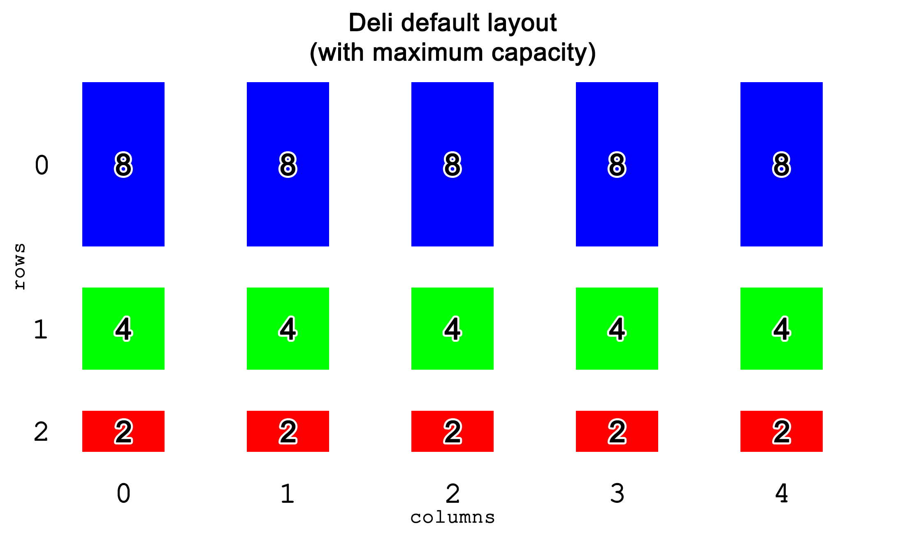
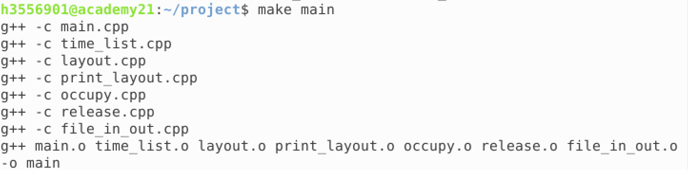
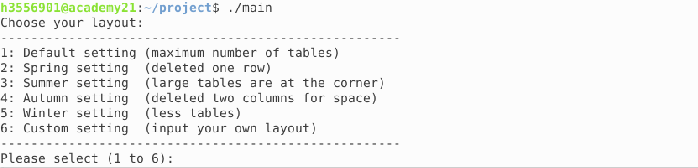
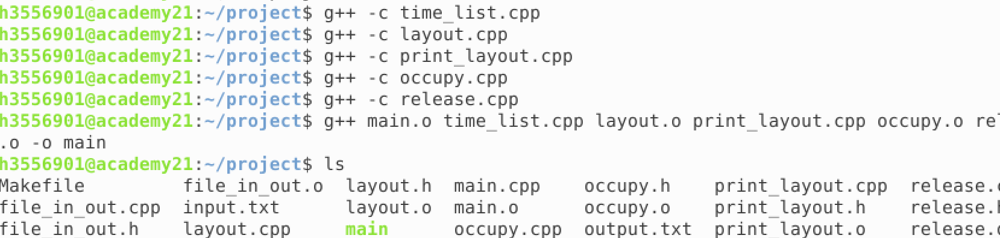

# 1340 group 114 (Table management system)

Contributors:

- Wong Ka Ngai (UID 3035568881)
- Wan Tsun Wai (UID 3035569017)

# Problem statement	

 Our family-owned deli lacks a table management system. We face a number of difficulties because of this.

**1. Availability of tables**

> Due to the lack of waiters, we cannot identify and manage vacant tables immediately. As a result, we often receive complaints from customers that the waiting time is too long.

**2. Management of seats**

> Sometimes when a large group of customers come, we cannot arrange tables with suitable size for them in a short time. We have to walk around the deli to find a table for them, which is time-consuming. Also when customers leave, we cannot know which table becomes vacant immediately.

**3. No trackable record of customer’s dining time**

> We do not know how long a customer has occupied a table. Therefore, we cannot identify those who occupied for a long time and politely ask them to leave. As a result, the table turnover rate is low.  

**4. Layout of deli**

> As the deli’s layout changes seasonally, it is hard for us to memorize the new layout, which results in a longer time to lead customers to a suitable table.

**5. Limited table size**

> During peak hours, we have to rearrange customers’ seat in order to maximize table usage. For example, when a group of 3 is waiting, we have to arrange them to share an 8-seat table with another 5 customers.  

# Problem settings

Dining area layout (default setting):



Maximum table size: 8

Size of tables available: 2,4,8

Total number of seats available: 70

Number of table for 2:  5

Number of table for 4: 5

Number of table for 8: 5

Number of customers for each entry: 1-8 (our deli cannot handle a group of customers with more than 8 people)

Preferable dining time for each customer: 1 hour, maximum 2 hours

Size of dining area: 2000 sq. ft. with maximum 3 rows X 5 columns (in rectangular shape)

Each table is named according to its coordinate, i.e. the table at upper left corner is named R0C0.

**Assumption**

1. Our deli cannot handle a group of customers with more than 8 people.

2. Our deli only has 2-seat tables, 4-seat tables and 8-seat tables. The maximum number for each is 5.

3. It is assumed that customers from the same group leave at the same time.

   - if a group of 6 customers entered the deli and occupied a 8-seat table R0C0, all of them leave the table at the same time.
   - **Number of customers left must equal to the size of group.** (in this case, 6)

```
Please input the row and column of the table and the number of customers left
Row number: 0
Column number: 0
Number of customers left: 6
```

4. It is assumed that customers from different groups sharing the same table, the two groups leave separately.

   - if a group of 5 customers and another group of 3 customers occupied a 8-seat table R0C0, when users want to manually release table R0C0, users have to use the "Release a table" function twice.
```
Please input the row and column of the table and the number of customers left
Row number: 0
Column number: 0
Number of customers left: 5
```
```
Please input the row and column of the table and the number of customers left
Row number: 0
Column number: 0
Number of customers left: 3
```
5. When there is not enough seats and customers separate into multiple groups to share tables with others,  they no longer considered as a group and they can leave seperately. Refer to assumption 4 for manual release.

   - if a group of 8 customers came in and separated into 4, 2, 2, the program considered it as 3 groups of customers. 

6. When customers occupied tables for 2 hours, it is considered as too long. 2 hours is scaled down to 20 seconds in real life for simplicity. 

# Functionalities and features	

### **1. Navigation menu**

In order to access different functions of this program, it provides a navigation menu for users to choose the corresponding function. The program will constantly print this menu after a action has done.

Below is how the menu looks like:
```
Input the corresponding number
---------------------------------------
1: Occupy a table
2: Release a table
3. Check tables occupied for too long
4. Show current availability of seats
5. End program
---------------------------------------
Your input:
```

### **2. Check current availability of seats**

To tackle problem of 1 (availability of tables), when this program print the layout of the deli, it also prints the current available seats of all tables next to the table size. The output of one table will be <table size - curr. ava.seat>.

For example, when there is 6 customers occupying a 8-seat table, that means 2 seats are available for this table. 
So, the output of that table will be 8-2.

The program will print the current layout as follows:
```
Current layout:
8-2 8-8 8-8 8-8 8-8
4-4 4-4 4-4 4-4 4-4
2-2 2-2 2-2 2-2 2-2
```
The above layout indicates that there is only 6 customers inside the deli, and they are occupying the 8-seat table in the upper left corner.

### **3. Occupy a vacant table**

To tackle problem 2 (management of seats) that occuppying a table is insufficient, when we input the number of customers, this program will automactically suggest a vacant table with minimal enough seats for this group of customers. When the number of customers is 5 to 8, this program will assign the 5 customers to occupy a vacant 8-seat table. If the number is 3 to 4, a vacant 4-seat table will be assigned. If the number is 1 to 2, 2-seat table will be used.

For example, if the input is 5, this program will assign the 5 customers to occupy a vacant 8-seat table. 

If inputs are 3 groups with number of customers 5, 4, 2 respectively, the output will be:
```
8-3 8-8 8-8 8-8 8-8
4-0 4-4 4-4 4-4 4-4
2-0 2-2 2-2 2-2 2-2
```

### **4. Release a table manually**

To tackle problem 2 (management of seats) that we fail to know which table is released, this program allows us to manually release tables. Users have to enter and row and column number of table, and the number of customers that left.

For example, if a group of 3 customers leaves 4-seat table R1C0, the input should be:

```
Please input the row and column of the table and the number of customers left
Row number: 1
Column number: 0
Number of customers left: 3
```

Refer to assumptions 3, 4, 5 for manual release.

### **5. Check tables occupied for too long**

To tackle problem 3 (no trackable record of customer’s dining time), the subprogram "Check tables occupied for too long" allows users to check whether there are tables occupied for too long whenever they want.

When this subprogram is called, it will check if there is any group of customers that occupied a table for more than 20 seconds in real life. If so, it will print out all the groups and ask whether the user want them to leave. If there is no group occupying too long, "There is no costumer occupied a table for too long." will be printed.

Example output when 3 groups of customers occupied tables for too long. (default layout)

```
2 customers occupied table R2C0 for too long.
4 customers occupied table R1C0 for too long.
8 customers occupied table R0C0 for too long.
Would you like those customers to leave?
Your choice(Y/N):
```

### **6. Release a table automatically**

If there are customers occupied for too long like the example above, and the user enter character **Y**, the program will automatically let those groups leave.

The next output for previous example is as follows:
```
Your choice(Y/N): Y
--------------------
Current layout:
8-8 8-8 8-8 8-8 8-8
4-4 4-4 4-4 4-4 4-4
2-2 2-2 2-2 2-2 2-2
--------------------
```
### **7. Change the layout of deli**

To tackle problem 4 (layout of deli), we have 5 preset layout options and 1 custom setting option for the user, including default setting, spring setting, summer setting, autumn setting and winter setting.

- Default setting (1)
```
8-8 8-8 8-8 8-8 8-8 
4-4 4-4 4-4 4-4 4-4 
2-2 2-2 2-2 2-2 2-2 
```
- Spring setting (2)
```
8-8 8-8 8-8 8-8 8-8 
X-X X-X X-X X-X X-X 
4-4 4-4 4-4 4-4 4-4
```
- Summer setting (3)
```
8-8 4-4 X-X 4-4 8-8 
X-X 2-2 2-2 2-2 X-X 
8-8 4-4 X-X 4-4 8-8 
```
- Autumn setting (4)
```
8-8 X-X 8-8 X-X 8-8 
4-4 X-X 4-4 X-X 4-4 
2-2 X-X 2-2 X-X 2-2 
```
- Winter setting (5)
```
X-X X-X X-X X-X X-X 
4-4 8-8 8-8 8-8 4-4 
X-X X-X X-X X-X X-X
```
- Custom setting (6)

For custom setting, input your desired layout (with 3 rows x 5 columns, input 0 if there is no table and space between integers is required.)

The occurrence of integers 8, 4 and 2 should not exceed 5 respectively. 

For example, input:
```
8 0 8 0 8
0 4 0 4 0
2 0 2 0 2
```
The custom setting will be:
```
8-8 X-X 8-8 X-X 8-8 
X-X 4-4 X-X 4-4 X-X 
2-2 X-X 2-2 X-X 2-2 
```


### **8. Table sharing**

To tackle problem 5 (limited table size), we implement an additional function which will arrange and split customers in order to have maximum table usage.
	
For example, in the default setting, if 4 groups of 6 people are in the deli, i.e.
```
8-2 8-2 8-2 8-2 8-2 
4-4 4-4 4-4 4-4 4-4 
2-2 2-2 2-2 2-2 2-2
```
another group of 6 people will not be able to occupy an 8-man table. Our system will then split them into multiple groups which most of them can sit together. 
Just like below:
```
8-2 8-2 8-2 8-2 8-2 
4-0 4-2 4-4 4-4 4-4 
2-2 2-2 2-2 2-2 2-2 
``` 
if we input one more group of 6 people in, the result will be like this:
```
8-2 8-0 8-2 8-2 8-2 
4-0 4-2 4-0 4-2 4-4
2-2 2-2 2-2 2-2 2-2 
```
So that the table usage is maximized.


### **9. File input and ouput to save record**

In order to keep records of deli’s operation, we implemented an additional function to store and export the record to a text file. 

The function will first open the file "input.txt" with yesterday’s record to get the accumulated number of customers.

Next, it will create a file "output.txt" and add up today’s number of customers to accumulated number of customers.

Then, it will export the total number of customers, the program ended time and a full record of today’s customers(number of customers and the respective table number).

Here is an example of the output file:

```
#output.txt
Accumulated total number of customers:
158
Total number of customers for today:
8
Program ended at:
Sat Apr 27 19:19:08 2019

Full record of today's customers (in descending order)
8 customers came in and occupied table R0C0

```

# Input specifications


### 1. Choose the desired layout

```
Choose your layout:
-----------------------------------------------------
1: Default setting (maximum number of tables)
2: Spring setting  (deleted one row)
3: Summer setting  (large tables are at the corner)
4: Autumn setting  (deleted two columns for space)
5: Winter setting  (less tables)
6: Custom setting  (input your own layout)
-----------------------------------------------------
Please select (1 to 6):
```

- Preset Layouts (1 to 5)

  - If you want to choose layout 1, type **1**

- Custom Layout

  - If you want to use custom setting, type **6** and then input your desired layout(with 3 rows x 5 columns, input 0 if there is no table and space between integers is required.
  - The occurance of integers 8, 4 and 2 should not exceed 5 respectively. Do not input integer except 0, 2, 4, 8.
  - An example:
```
8 0 8 0 8
0 4 0 4 0
2 0 2 0 2
```

### 2. Table Management

```
--------------------
Current layout: 
8-8 8-8 8-8 8-8 8-8 
4-4 4-4 4-4 4-4 4-4 
2-2 2-2 2-2 2-2 2-2 
--------------------
Input the corresponding number
---------------------------------------
1: Occupy a table
2: Release a table
3. Check tables occupied for too long
4. Show current availability of seats
5. End program
---------------------------------------
Your input: 
```
- **Occupy a table**
   - if you want to occupy a table when customers come in, type **1**. The serial output will be as follows:
```
Number of customers (1-8): 
```
 >type the numbers of customers(from 1-8, cannot exceed 8)
 
 
- **Release a table**
   - if you want to release a table manually, type **2**. The serial output will be as follows:
```
Please input the row and column of the table and the number of customers left
Row number: 
Column number: 
Number of customers left: 
```
 >First input the row number, and then the column number, finally the number of customers that you wanted them to leave. 
 
 >Row number is in range 0 to 2, column number is in range 0 to 4 and number of customers left is in range 0 to 8.
 
 
- **Check tables occupied for too long**
   - if you want to check whether there are customers occupied the seats for too long, type **3**; case 1 will happen if no customers occupied the seats for too long, otherwise case 2 will happen.
   
*case 1:*
```
There is no costumer occupied a table for too long.
```
*case 2:*
```
Would you like those customers to leave?
Your choice(Y/N): 
```
 >if you want to remove the customers that occupied the seats for too long and release the table automatically, type **Y**, otherwise **N**.
 
- **Show current availability of seats**
   - if you want to see the current status of the deli, type **4**.
   

- **End program**
   - if you want to end the program, type **5**.


# Output specifications
	
A text file named “*output.txt*” will be generated, here is an example:
```
#output.txt
Accumulated total number of customers:
150
Total number of customers for today:
0
Program ended at:
Sat Apr 27 17:44:14 2019

Full record of today's customers (in descending order)
```

The number of accumulated customers, the total number of customers today, the program ended time and a full record of today’s customers will be showed(number of customers and the respective table number)


# Compilation and execution instructions

**1. Makefile execution**

I. Use this command line to compile all files:
 ```
 make main
 ```

II. Run the executable “main” by typing “./main” at the prompt



**2. Manual compilation and execution**

I. Use these command lines to compile all files separately:
 ```
 g++ -c time_list.cpp
 
 g++ -c layout.cpp
 
 g++ -c print_layout.cpp
 
 g++ -c occupy.cpp
 
 g++ -c release.cpp
 
 g++ -c file_in_out.cpp
 
 g++ -c main.cpp

 g++ main.o time_list.o layout.o print_layout.o occupy.o release.o file_in_out.o -o main
 ```
 
II. If the compilation is successful, you should find another file “main” in the working directory.



III.Run the executable “main” by typing “./main” at the prompt


